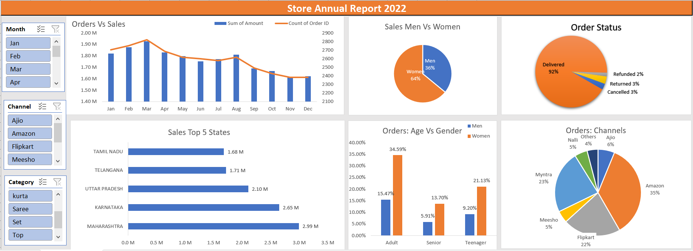

# 🛒 Store Annual Sales Analysis Dashboard (Excel)

## 📊 Project Overview  
This project focuses on analyzing annual sales data to uncover key business insights and improve decision-making. An interactive Excel dashboard was developed to track sales performance, customer behavior, and channel contributions across different regions and time periods.

---

## 🎯 Objectives  
- Analyze sales trends over time  
- Identify top-performing states and sales channels  
- Understand customer demographics and purchasing behavior  
- Provide actionable insights to improve business performance  

---

## 🛠️ Tools & Technologies  
- Microsoft Excel  
- Pivot Tables & Pivot Charts  
- Data Cleaning & Transformation  
- Data Visualization  
- Dashboard Design  

---

## 📌 Key Features  
- Interactive dashboard with filters for Month, Channel, and Category  
- Sales vs Orders analysis using combined charts  
- Customer segmentation based on age and gender  
- Channel-wise sales contribution analysis  
- Top-performing states and categories visualization  
- Order status breakdown (Delivered, Cancelled, Returned, Refunded)  

---

## 📈 Key Insights  
- Women customers contributed the majority of total sales (~64%)  
- Adult age group (30–49 years) generated the highest revenue share  
- Maharashtra, Karnataka, and Uttar Pradesh were the top-performing states  
- Amazon, Flipkart, and Myntra accounted for the majority of sales (~80%)  
- Most orders were successfully delivered (~90%+), indicating strong operational efficiency  

---

## 📷 Dashboard Preview  

---

## 📂 Dataset  
The dataset includes sales transactions with details such as:  
- Order ID  
- Customer details (Age, Gender)  
- Product category and sub-category  
- Sales amount and quantity  
- Order status  
- Sales channel (Amazon, Flipkart, Myntra, etc.)  
- State and region  

---

## 🚀 Project Outcome  
This project demonstrates the ability to clean, analyze, and visualize data using Excel, and to extract meaningful insights that can support business strategy and decision-making.

---

## 🔗 Project Files  
- Excel Dashboard File (.xlsx)  
- Dataset (.csv / .xlsx)  
- Dashboard Screenshot  

---
